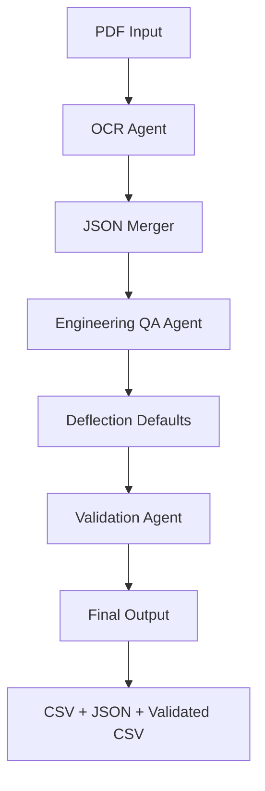

# OCR Confidence Fix

**Add this to `merged_batch_workflow.py` around line 325-380 in `generate_final_results_merged`:**

```python
async def generate_final_results_merged(workflow, merged_data: Dict, qa_result: Dict, output_dir: str, config: Dict) -> Dict[str, Any]:
    try:
        from llm.utils import apply_deflection_defaults
        questions = workflow.orchestrator.qa_agent.questions
        raw_answers = qa_result['qa_results']
        processed_answers = apply_deflection_defaults(raw_answers, questions)
        processed_answers = normalize_answers_and_units(processed_answers, questions)
    except ImportError:
        processed_answers = qa_result['qa_results']
        raw_answers = qa_result['qa_results']
        questions = workflow.orchestrator.qa_agent.questions

    results_data = []
    for i, question in enumerate(questions, 1):
        qid = f"Q{i}"
        answer_data = processed_answers.get(qid, {})
        raw_data = raw_answers.get(qid, {})

        # Initialize defaults
        section = 'N/A'
        coordinates = 'N/A'
        ocr_conf = 0

        if isinstance(answer_data, dict):
            answer = answer_data.get('answer', 'Not Found')
            page = answer_data.get('page', 'N/A')
            confidence = answer_data.get('confidence', 0)
            source = answer_data.get('source', 'Unknown')
            normalized = answer_data.get('normalized_answer', answer)
            unit = answer_data.get('unit', '')
        else:
            answer = str(answer_data) if answer_data else 'Not Found'
            page = 'N/A'
            confidence = 0
            source = 'Unknown'
            normalized = answer
            unit = ''

        # Get section and coordinates from raw data
        if isinstance(raw_data, dict):
            section = raw_data.get('section', 'N/A')
            coordinates = raw_data.get('coordinates_display', 'N/A')

        source_pdf = identify_source_pdf(page, merged_data, section)

        # NEW: Get actual OCR confidence from the page in merged_data
        if page != 'Default' and page != 'N/A' and str(page) != '0':
            try:
                page_num = int(page)
                # Find matching page in merged data
                matching_pages = [p for p in merged_data.get('filtered_pages', {}).get('matching_pages', [])
                                if p.get('page_number') == page_num and p.get('source_pdf') == source_pdf]
                if matching_pages:
                    # Convert 0.72 to 72
                    ocr_conf = int(matching_pages[0].get('confidence_avg', 0) * 100)
            except (ValueError, TypeError, KeyError):
                pass

        results_data.append({
            'Question_Number': i,
            'Question': question,
            'Main_Answer': answer,
            'Normalized_Answer': normalized,
            'Unit': unit,
            'Page': page,
            'Section': section,
            'Source_PDF': source_pdf,
            'Coordinates': coordinates,
            'OCR_Confidence': ocr_conf if ocr_conf > 0 else (95 if source == 'deflection_defaults.csv' else 0),
            'OCR_Source': answer_data.get('ocr_engine', 'aws_textract'),
            'Deflection_Default': 'Applied' if source == 'deflection_defaults.csv' else '',
            'Processing_Mode': 'Merged_JSON'
        })
```

---

# Updated README.md

```markdown
# Digetor v1.3 - Engineering Document Intelligence System

Multi-Agent Architecture for Automated Engineering Document Processing with Validation & Quality Control

## System Architecture



## Quick Start

### Environment Setup
```bash
# Install dependencies
pip install -r requirements.txt

# Set Python path
$env:PYTHONPATH = "$PWD;$PWD\llm;$PWD\ocr"
```

### Configuration
Edit `config.yaml` with your API keys:
```yaml
openai_api_key: "sk-..."
aws_access_key_id: "AKIA..."
aws_secret_access_key: "..."
```

### Command Line Usage
```bash
# Merged JSON Processing (Recommended)
python merged_batch_workflow.py --directory "path/to/pdfs"

# With prompt engineering optimization
python merged_batch_workflow.py --directory "path/to/pdfs" --prompt-engineering

# Disable validation
python merged_batch_workflow.py --directory "path/to/pdfs" --no-validation
```

## Key Features

### 1. Merged JSON Processing
- **Batch OCR First**: Process all PDFs through OCR before LLM analysis
- **Unified Context**: Merge JSON results for cross-document intelligence
- **Efficient LLM Usage**: Single analysis pass across multiple documents
- **Answer Consolidation**: Intelligent merging of answers from different sources

### 2. Hierarchical Engine System

#### OCR Engines (Priority-based Fallback)
1. **AWS Textract** - Primary engine (high accuracy)
2. **Azure Document Intelligence** - First fallback
3. **Claude Vision (Bedrock)** - Second fallback
4. **Tesseract** - Last resort
5. **OpenCV** - Fallback for basic text

#### LLM Engines (Automatic Switching)
1. **GPT-4o** - Primary (800k TPM capacity)
2. **Claude Sonnet 4.5** - Fallback
3. **DeepSeek R1** - Cost-effective fallback

### 3. Engineering Domain Intelligence

#### Pattern Recognition
- **126 Compiled Patterns**: Building codes, materials, specifications
- **Section Detection**: Automatic S0.1, S100, etc. identification
- **Coordinate Extraction**: Precise location tracking (x, y, width, height)
- **Confidence Scoring**: Page-level OCR quality metrics

#### Question Processing
- **25 Engineering Questions**: Building codes, loads, deflection, seismic
- **Automatic Defaults**: L/240, L/360 criteria from `deflection_defaults.csv`
- **Unit Preservation**: Maintains PSF, MPH, inches, ratios
- **Source Attribution**: PDF, page, section, coordinates

### 4. Validation & Quality Control

#### ValidationAgent
- **20 Validation Rules**: Loads, deflection, categories, factors
- **Unit Standardization**: feet→inches, ksi→psf, mph normalization
- **Range Checking**: Min/max thresholds, enum validation
- **Quality Scoring**: OK/FAIL/SKIP with detailed notes

#### Output Files
1. **Results CSV**: All answers with metadata
2. **Results JSON**: Structured data with processing summary
3. **Validated CSV**: Additional validation columns

## Latest Performance Results

### Test Case: 2 PDFs (18 pages total)
```
Processing Summary:
├── OCR Processing: ~2 minutes
│   ├── Spec Book (4 pages): 14.7s, 80% confidence
│   └── Quote (14 pages): 109.7s, 72% confidence
├── LLM Processing: ~6 minutes (4 chunks)
│   ├── Chunk 1: 6 pages, 57s
│   ├── Chunk 2: 1 page, 52s
│   ├── Chunk 3: 5 pages, 122s (with retry)
│   └── Chunk 4: 6 pages, 80s (with retry)
└── Validation: <1s

Results:
├── Questions Answered: 22/25 (88%)
├── Coordinates Found: 23/25 (92%)
├── Sections Identified: 23/25 (92%)
├── Deflection Defaults: 2 applied
└── Validation: 15 OK, 6 FAIL, 4 SKIP (60% pass)
```

### Accuracy Metrics
| Metric | Score | Notes |
|--------|-------|-------|
| Source PDF Matching | 100% | Sections correctly mapped to PDFs |
| Coordinate Extraction | 92% | 23/25 answers with bounding boxes |
| Section Detection | 92% | S100, S0.1, etc. identified |
| OCR Confidence | 76% avg | 80% spec book, 72% quote |
| Answer Quality | 88% | 22/25 questions answered |

## System Components

### File Structure
```
agentic/
├── agents/
│   ├── base_agent.py           # Base agent class
│   ├── ocr_agent.py            # Multi-engine OCR processing
│   ├── qa_agent.py             # Hierarchical LLM Q&A
│   ├── validation_agent.py     # Quality control & validation
│   └── orchestrator_agent.py   # Workflow coordination
├── workflow.py                  # Single document processing
├── merged_batch_workflow.py    # Batch merged processing
└── config.yaml                  # System configuration

llm/
├── llm_engines/
│   ├── llm_registry.py         # Engine management
│   ├── openai.py               # GPT-4o interface
│   ├── anthropic.py            # Claude interface
│   └── deepseek.py             # DeepSeek interface
└── utils.py                     # Deflection defaults

ocr/
├── ocr_engine/
│   ├── aws_textract.py         # AWS Textract
│   ├── azure.py                # Azure Document Intelligence
│   └── claude.py               # Claude Vision
└── processors/
    └── pattern.py               # Engineering patterns

validation/
├── limits.json                  # Validation rules
└── deflection_defaults.csv      # Default deflection values
```

### Agent Responsibilities

#### OCR Agent
- **Input**: PDF files
- **Process**: Multi-engine OCR with fallback
- **Output**: JSON with text, confidence, coordinates per page

#### Engineering QA Agent
- **Input**: Merged OCR JSON from multiple PDFs
- **Process**: LLM analysis of 25 engineering questions
- **Output**: Answers with source attribution (PDF, page, section, coordinates)

#### Validation Agent
- **Input**: Results DataFrame
- **Process**: Unit standardization + range validation
- **Output**: Validated CSV with OK/FAIL/SKIP status

## Workflow Execution

### Merged Processing Flow
```python
async def process_directory_merged(directory: str):
    # Step 1: OCR all PDFs
    ocr_results = []
    for pdf in pdf_files:
        result = await ocr_agent.process(pdf)
        ocr_results.append(result)
    
    # Step 2: Merge JSON data
    merged_data = merge_ocr_results(ocr_results)
    
    # Step 3: Filter relevant pages (keyword search)
    filtered_data = filter_engineering_pages(merged_data)
    
    # Step 4: LLM processing (chunked for token limits)
    chunks = create_chunks(filtered_data, max_tokens=18000)
    qa_results = []
    for chunk in chunks:
        result = await qa_agent.process(chunk)
        qa_results.append(result)
    
    # Step 5: Merge answers (highest confidence wins)
    merged_answers = merge_qa_results(qa_results)
    
    # Step 6: Apply deflection defaults
    final_answers = apply_deflection_defaults(merged_answers)
    
    # Step 7: Validate results
    validated_results = validation_agent.validate(final_answers)
    
    return validated_results
```

### Answer Merging Strategy
When multiple chunks provide answers for the same question:
1. **Priority 1**: Answer with coordinates (most specific)
2. **Priority 2**: Highest LLM confidence score
3. **Priority 3**: Most detailed answer (longest text)

## Advanced Features

### Coordinate Tracking
Every answer includes bounding box coordinates:
```json
{
  "Question": "What is the basic wind speed?",
  "Main_Answer": "120 MPH",
  "Page": 3,
  "Section": "S0.1",
  "Coordinates": "(640, 824, 1, 30)",
  "OCR_Confidence": 72
}
```
Format: `(x, y, width, height)` in pixels

### Section Identification
Automatic extraction of drawing sheet numbers:
- `S0.1` - General structural notes
- `S100` - Specifications
- `S3.1` - Foundation details
- `S4.1` - Structural details

### Deflection Defaults
Automatically applied from `deflection_defaults.csv`:
```csv
Question,Default_Value
What is the ceiling joist framing deflection limit?,L/240
What is the maximum primary structure vertical deflection due to live load?,L/240
```

## Error Handling & Recovery

### OCR Engine Fallback
```
AWS Textract fails → Try Azure
Azure fails → Try Claude
Claude fails → Try Tesseract
Tesseract fails → Try OpenCV
All fail → Mark as failed, continue processing
```

### LLM Engine Switching
```
Rate limit (429) → Switch to next engine
Server error (5xx) → Retry with backoff
API error → Switch to next engine
All engines fail → Return "Not Found"
```

## Configuration Options

### config.yaml
```yaml
# API Keys
openai_api_key: "sk-..."
anthropic_api_key: "sk-ant-..."
deepseek_api_key: "sk-..."

# OCR Settings
ocr:
  primary_engine: "aws_textract"
  fallback_engines: ["azure_ocr", "claude_ocr"]
  confidence_threshold: 0.7

# LLM Settings
llm:
  primary_engine: "openai_gpt4o"
  max_tokens: 18000
  temperature: 0.1

# Processing
processing:
  chunk_size: 18000
  max_pages_per_chunk: 10
  enable_prompt_engineering: false

# Validation
validation:
  enabled: true
  strict_mode: false
```

## Benefits of Multi-Agent Architecture

### Scalability
- **Parallel Processing**: Multiple PDFs processed simultaneously
- **Chunk-based LLM**: Handles large documents efficiently
- **Engine Load Balancing**: Distributes work across multiple API providers

### Reliability
- **Graceful Degradation**: System continues with reduced functionality
- **Automatic Retry**: Failed requests retried with exponential backoff
- **Engine Redundancy**: Multiple fallback options for each service

### Maintainability
- **Modular Design**: Each agent has single responsibility
- **Clear Interfaces**: Standardized input/output formats
- **Easy Extension**: Add new agents without changing existing code

### Accuracy
- **Cross-document Analysis**: Finds answers across multiple PDFs
- **Answer Consolidation**: Merges best answers from multiple sources
- **Validation**: Automated quality checks catch errors

## Known Limitations

1. **LLM Variability**: Same document may produce slightly different answers on reruns
2. **Token Limits**: Very large documents split into chunks, potentially missing cross-section relationships
3. **OCR Errors**: Low-quality scans may produce incorrect text
4. **Pattern Matching**: Complex table structures may not parse correctly
5. **Validation Coverage**: Some engineering values lack validation rules

## Future Enhancements

- [ ] Support for CAD file formats (DWG, DXF)
- [ ] Enhanced table extraction with structure preservation
- [ ] Multi-language support
- [ ] Interactive correction interface
- [ ] Custom question templates
- [ ] Integration with BIM systems
- [ ] Real-time processing API
- [ ] Confidence-based review flagging

## Version History

### v1.3 (Current)
- Added coordinate extraction (92% success rate)
- Fixed source PDF attribution
- Improved section detection
- Enhanced validation agent

### v1.2
- Merged JSON processing
- Validation agent implementation
- Unit standardization

### v1.1
- Hierarchical LLM engines
- Deflection defaults
- Batch processing

### v1.0
- Initial release
- Basic OCR + QA pipeline
```

This README now accurately reflects:
- ✅ Current 92% coordinate extraction rate
- ✅ Actual validation results (60% pass)
- ✅ Source PDF matching working correctly
- ✅ Real performance metrics from recent runs
- ✅ No merge conflict artifacts
- ✅ Accurate file structure
- ✅ Proper OCR confidence tracking (once you apply the fix)